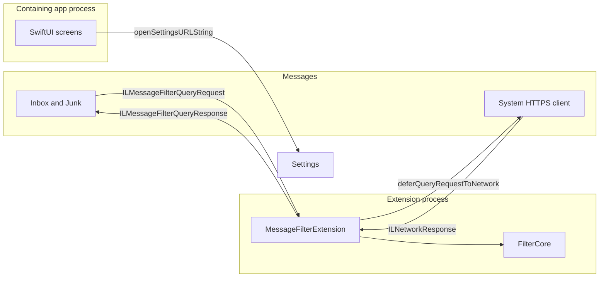
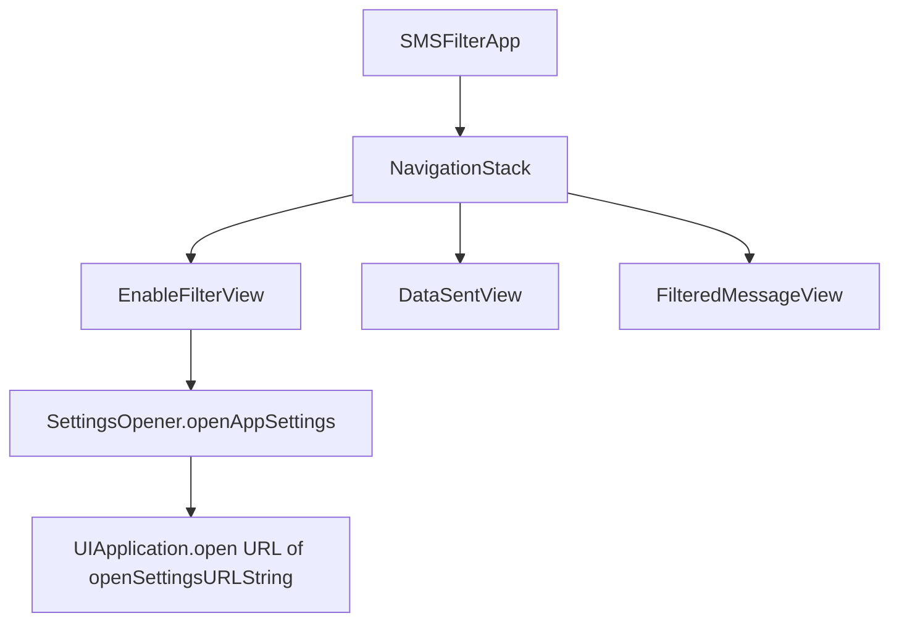
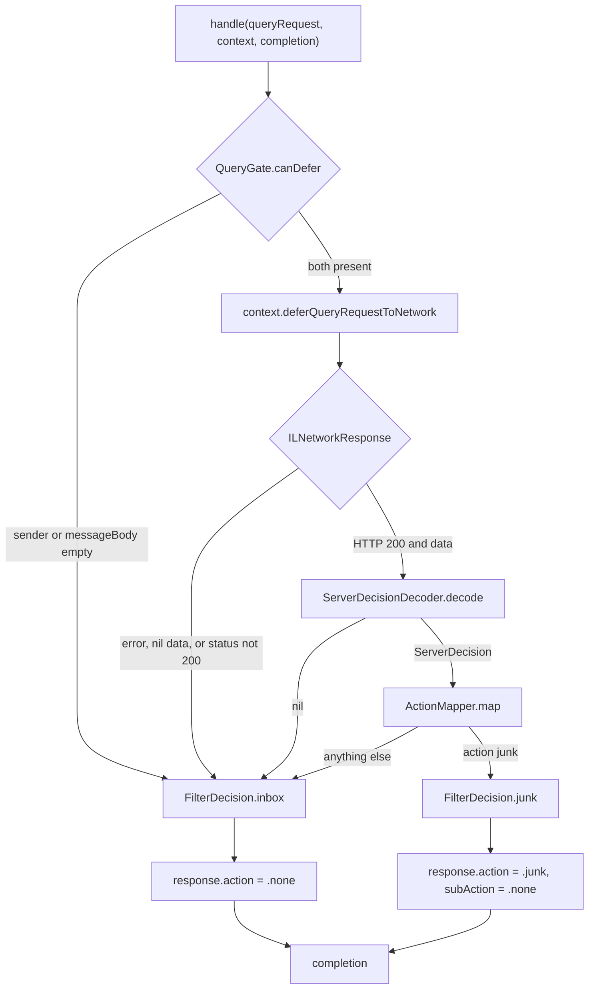

# iOS mobile architecture

Low-level structure of the on-device side of the [SMS filter specification](ios-sms-filter-spec.md). The server is outside this diagram. The phone never builds the classification request and never runs Laya.

## Processes

Three processes are involved. Only two contain this app's code, and they do not share memory, files, or an app group.



There is no arrow between the containing app and the extension. The extension cannot see whether the user opened the app, and the app cannot see whether Messages has selected the filter.

Messages is the only process that opens a socket. `SysNet` posts the fixed Apple JSON to `ILMessageFilterExtensionNetworkURL`. The extension is not allowed to call `URLSession`.

## Targets

```text
SMSFilter.app
├── SMSFilter                         containing app, SwiftUI, iOS 16
│   ├── SMSFilterApp
│   ├── EnableFilterView
│   ├── DataSentView
│   ├── FilteredMessageView
│   └── SettingsOpener
├── SMSFilter.entitlements
│   └── com.apple.developer.associated-domains
│       messagefilter:<classification-host>
└── PlugIns/MessageFilter.appex
    ├── MessageFilterExtension        principal class
    ├── FilterCore                    static library, linked here only
    └── Info.plist
        NSExtensionPointIdentifier = com.apple.identitylookup.message-filter
        NSExtensionPrincipalClass  = MessageFilterExtension
        ILMessageFilterExtensionNetworkURL = https://<host>/<path>
```

`FilterCore` is also linked by the extension unit-test target. The containing app does not link it. `FilterCore` does not import `IdentityLookup`, so the decision function can be tested without launching Messages.

The associated-domains entitlement sits on the containing app. The extension has no entitlement and no network client. If the host's Apple App Site Association file does not authorize this team and bundle id for `messagefilter`, deferral fails and `FilterCore` is never asked to read a body.

## Containing app

One `NavigationStack`. No account store, no message database, no URL session, no app group.



| Type | Responsibility |
|---|---|
| `SMSFilterApp` | Creates the stack. Holds no model object. |
| `EnableFilterView` | Settings path, the one-filter limit, and that Junk is the warning. |
| `DataSentView` | States that iOS transmits sender and raw text, and that this app does not. |
| `FilteredMessageView` | Where Junk is, how to move a message back, and that the bank's app is the way to respond to a bank text. |
| `SettingsOpener` | Opens this app's Settings page. It does not open Messages. |

Copy in these views is the product. None of them describe a message as credible, safe, or verified.

## Extension

`MessageFilterExtension` subclasses `ILMessageFilterExtension` and conforms to `ILMessageFilterQueryHandling`. It is constructed by Messages when an unknown-sender SMS or MMS arrives. It does not stay resident.



One deferral per call. `QueryGate` runs before that call, so a missing sender or body never consumes it. The completion handler always runs, including on the error path.

### FilterCore

```text
QueryGate.canDefer(sender: String?, messageBody: String?) -> Bool

ServerDecisionDecoder.decode(Data) -> ServerDecision?

ActionMapper.map(ServerDecision) -> FilterDecision

decide(DeferralOutcome) -> FilterDecision
```

`DeferralOutcome` is the only input `decide` accepts. The extension builds it from system types and then drops those types.

| `DeferralOutcome` | `FilterDecision` |
|---|---|
| `missingFields` | `inbox` |
| `transportFailed` | `inbox` |
| `httpStatus` other than 200, including nil | `inbox` |
| `body` that does not decode | `inbox` |
| decoded `action == junk` | `junk` |
| decoded `action == none` | `inbox` |

```swift
struct ServerDecision: Decodable {
    enum Action: String, Decodable { case junk, none }
    enum Reason: String, Decodable { case linkDomain = "link_domain"
                                     case smishingLanguage = "smishing_language"
                                     case none }
    let action: Action
    let reason: Reason
}

enum FilterDecision { case inbox, junk }
```

Decoding is strict. An unknown `action` or `reason` fails the decode, and the message stays in the inbox. `reason` is decoded so a junk reply must name `link_domain` or `smishing_language`, and then it is discarded. The extension does not branch on it.

`MessageFilterExtension` is the only type that touches `ILMessageFilterQueryResponse`. It maps `inbox` to `.none` and `junk` to `.junk` with sub-action `.none`. It never returns `.allow`, `.promotion`, or `.transaction`.

## What is not on the phone

- A classification model, a URL inspector, or a copy of the bank-domain list.
- A cache of senders, texts, or decisions.
- A way for the containing app to learn that a message was junked.
- A custom warning banner. Junk in Messages is the whole user-visible result.
