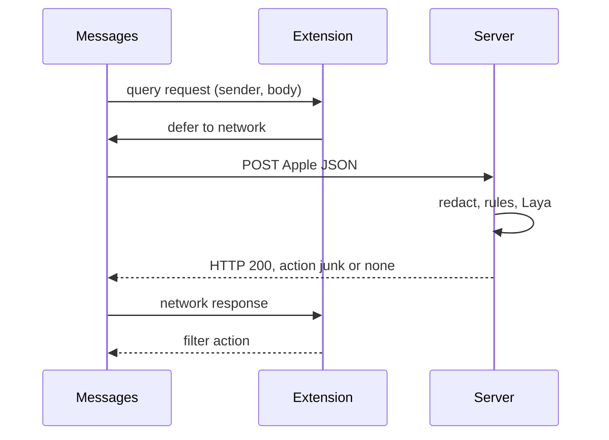

# iOS SMS filter specification

Version 1. This document specifies the iOS app. It does not specify the server implementation beyond the contract the app depends on.

## 1. Problem

A person receives an SMS that pretends to be their bank and asks them to verify, unlock, or pay. The dangerous act is the next one they take: open the link, call the number, or read out a one-time code.

This version does one job: for SMS and MMS from senders who are not in Contacts, decide whether Messages should file that message under Junk.

Filing under Junk is the only warning iOS gives a Message Filter app. The app cannot attach a banner, and it cannot confirm that the event in the text exists at the bank. A message left in the inbox has not been certified as genuine.

## 2. Decisions locked for this version

- Classification runs on a server the operator controls. The model is Laya. It does not run on the phone.
- The phone does not build the request. After the extension defers, iOS posts the sender and the raw message text to a fixed URL.
- The server removes one-time codes, card numbers, and similar secrets before classification and before any log. The app cannot remove them first.
- The server returns `junk` or `none`. The extension maps those onto Apple's filter actions.
- `junk` is used only for a high-confidence result: the link domain does not belong to the bank named in the text, or Laya's smishing score and confidence both clear a threshold that has been fitted so genuine bank alerts and one-time-code texts stay below it.
- A middle score returns `none`. iOS cannot show a softer warning. Delivering the message is preferred to hiding a real bank alert in Junk.
- Timeout, HTTP error, or an unreadable body returns `none`. The message stays in the inbox.
- The product never tells the user a message is credible or safe.

## 3. Out of scope

- Wi-Fi attacks, iMessage, and messages from senders saved in Contacts. Messages does not offer those to this extension.
- Android.
- A bank login, a bank API, or a check that a charge or block really exists.
- On-device Laya, or any classifier inside the extension.
- Accounts, message history, and a custom inbox.
- Reading the user's correction when they move a message from Junk back to the inbox.
- Promotional and transactional folders. A phishing text must not be filed where people expect legitimate commerce or payments.

## 4. Platform constraints

These are properties of the IdentityLookup message filter, not choices.

| Constraint | Consequence |
|---|---|
| Unknown senders only | Contacts are never classified |
| SMS and MMS only | iMessage is never classified |
| One filter selected in Settings | Enabling this app replaces another SMS filter |
| Extension cannot open a connection | Only `deferQueryRequestToNetwork()` may reach the server |
| Extension cannot write a shared container | No allowlist or token shared with the containing app |
| Network URL is fixed in `Info.plist` | Every install posts to the same host. There is no per-user URL |
| System posts Apple's JSON | The body is raw text. See the request in section 8 |
| Associated domain required | The host must be authorized or deferral fails with `networkURLUnauthorized` |
| Deferral may be used once per query | A second deferral fails with `redundantNetworkDeferral` |
| User-visible results | `none` and `allow` leave the message in the inbox. `junk` files it under Junk |

Minimum system version is iOS 16.

The containing app cannot detect whether the user has selected this filter.

## 5. Components



The app is two targets:

1. A containing app that explains the filter and how to turn it on.
2. A Message Filter extension that defers every classifiable query and translates the server reply.

## 6. Containing app

Three screens. No account, no message list, no score.

### 6.1 Enable

Explains that Messages will send unknown SMS and MMS to the classification server, and that caught messages appear under Junk.

Steps, written for the current Settings layout:

1. Open Settings.
2. Open Apps, then Messages. On systems that still list Messages at the top level of Settings, open Messages directly.
3. Open Unknown & Spam.
4. Under SMS Filtering, select this app.

The screen states that only one SMS filter can be selected, and that there is no in-app switch. The app does not deep-link into Messages settings. It may open its own Settings page.

### 6.2 What is sent

Plain language, visible without opening a policy URL:

- For an SMS or MMS from a sender not in Contacts, iOS sends the sender and the full text to the classification server.
- The server strips one-time codes and payment numbers, classifies the remainder, and discards the text after it replies.
- Messages from Contacts and iMessages are not sent.
- The app does not declare a message safe.

Link to the privacy policy from this screen.

### 6.3 If a message was filtered

Explains where Junk lives in Messages and how to move a message back to the inbox.

States the standing instruction: a text that asks for a code, a payment, or a login is handled by opening the bank's own app. The link or number in the text is not the way in.

## 7. Extension

Principal class implements `ILMessageFilterQueryHandling`.

`Info.plist`:

- `NSExtensionPointIdentifier` is `com.apple.identitylookup.message-filter`.
- `NSExtensionPrincipalClass` is the filter class.
- `NSExtensionAttributes` → `ILMessageFilterExtensionNetworkURL` is the HTTPS classification URL.

The containing app's associated-domains entitlement includes `messagefilter:<host>` for that URL's host. The host serves an Apple App Site Association file that authorizes this app's team and bundle identifier for the `messagefilter` service. Without that, deferral fails and every message stays in the inbox.

### 7.1 Handling a query

1. If the sender or the text is missing, respond with action `none` and do not defer.
2. Otherwise call `deferQueryRequestToNetwork` once.
3. On a network error, respond with action `none`.
4. On a body that is not the JSON in section 8, or an `action` other than `junk`, respond with action `none`.
5. On `action` equal to `junk`, respond with `ILMessageFilterAction.junk` and sub-action `none`.

The extension does not inspect the text, does not call `URLSession`, and does not write to disk.

## 8. Server contract

The app depends on this contract. The server's internal pipeline is specified only as far as the app's privacy claims and action mapping require.

### 8.1 Request

iOS sends this JSON. The server must accept it. Field names are Apple's.

```json
{
  "_version": 1,
  "query": {
    "sender": "14085550001",
    "message": {
      "text": "We locked your card. Confirm at the link."
    }
  },
  "app": {
    "version": "1"
  }
}
```

`sender` is a phone number or an alphanumeric sender id. `message.text` is the raw SMS body.

### 8.2 Processing the server must do before it stores or classifies

1. Copy the text into memory and replace one-time codes, primary account numbers, and similar digit secrets with a flag such as `contains_one_time_code`. The original digits are dropped.
2. Extract link domains and whether a phone number is present.
3. Apply domain rules. If the text names a bank and a link domain is not that bank's domain, the action is `junk` with reason `link_domain`.
4. Otherwise ask Laya, on an already-loaded multilingual checkpoint, for `is_smishing`, `is_spam`, and `asks_to_continue_off_app`.
5. Apply the policy in section 9.
6. Reply, then discard the text. Do not write the sender, the raw text, or the redacted text to a log or a database.

Operational metrics may count actions and reason codes. They must not include message content or sender identifiers.

The endpoint is public and will be probed. Rate-limit by IP. The reply contains no weights, thresholds, or prompt text.

### 8.3 Response

HTTP 200 and this JSON:

```json
{
  "action": "junk",
  "reason": "link_domain"
}
```

| Field | Values |
|---|---|
| `action` | `junk` or `none` |
| `reason` | `link_domain`, `smishing_language`, or `none` |

`reason` is `smishing_language` when `junk` came from Laya. It is `none` when `action` is `none`. The extension may ignore `reason`.

Any status other than 200 is a failure. The extension then uses action `none`.

The model is loaded before traffic arrives. A cold load is not part of the request path.

## 9. Decision policy

| Evidence | `action` | `reason` |
|---|---|---|
| Link domain is not the named bank's domain | `junk` | `link_domain` |
| Laya `is_smishing` and confidence both at or above the fitted high threshold | `junk` | `smishing_language` |
| Anything else, including a middle score | `none` | `none` |

The high threshold is fitted on a set split by week, with genuine bank alerts and one-time-code texts held out. Those held-out texts must receive `none`. Until that bar is met, the server may return `junk` only for `link_domain`.

`is_spam` does not file the message under Junk in this version. Ordinary marketing is not the harm this app is for, and a spam folder is not available as a separate inbox warning.

## 10. Privacy

The App Store privacy policy and the in-app screen in section 6.2 match the real behavior:

- Data transmitted: sender and full message text of unknown SMS and MMS, plus the app version.
- Purpose: classification.
- Retention: none for content and sender. Aggregate action counts are allowed.
- No account, no advertising identifier, no third-party analytics SDK that receives the message.
- The classification host is operated for this app. The text is not forwarded to a hosted Laya API.

## 11. Failure behavior

| Situation | What the user sees |
|---|---|
| Filter not selected in Settings | Messages behaves as if the app were not installed |
| Associated domain missing or wrong | Deferral error, message stays in the inbox |
| Airplane mode, timeout, or HTTP error | Message stays in the inbox |
| Server returns `junk` | Message is under Junk and can be moved back |
| Sender is a Contact, or the message is iMessage | Not evaluated |

## 12. Acceptance

1. An unknown-sender SMS that the server marks `junk` appears under Junk, including when the reason is `link_domain` and when it is `smishing_language`.
2. An unknown-sender SMS that the server marks `none` stays in the inbox.
3. A response that is not the JSON in section 8.3, or an HTTP error, leaves the message in the inbox.
4. With the device offline, an unknown-sender SMS stays in the inbox.
5. An iMessage and an SMS from a Contact are not posted to the classification URL.
6. The extension issues at most one deferral per query and does not open its own connection.
7. The Enable screen states the Settings path, that only one SMS filter can be active, and that Junk is where filtered messages go.
8. The privacy screen states that the sender and the full text are transmitted, that secrets are stripped on the server, and that the text is not stored.
9. No screen describes a message as credible, safe, or verified.
10. Server logs for a live classification contain neither the sender nor the message text.
