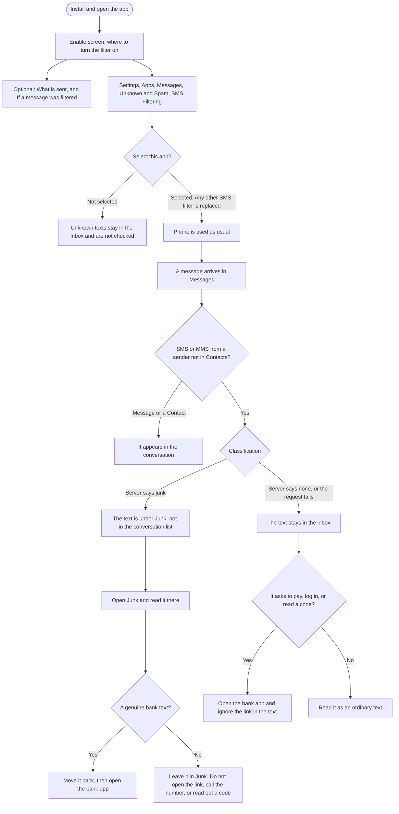

# iOS user flow

How a person uses the SMS filter. The containing app is the setup. Messages is where a text is kept or filed under Junk. This follows the [specification](ios-sms-filter-spec.md).

## What the person can and cannot see

- The app has no switch. Selection happens in Settings, and the app cannot tell whether it is the active filter.
- A text left in the inbox has not been marked safe. The screens never say credible, verified, or safe.
- Junk is the only signal. There is no banner on the message.
- A text from someone in Contacts, and every iMessage, never enters this flow.
- Offline, or any server failure, takes the inbox branch.
