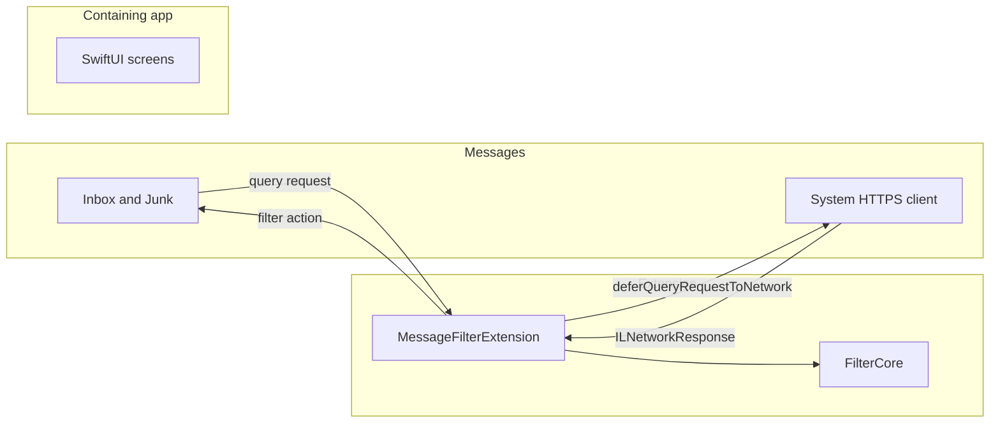
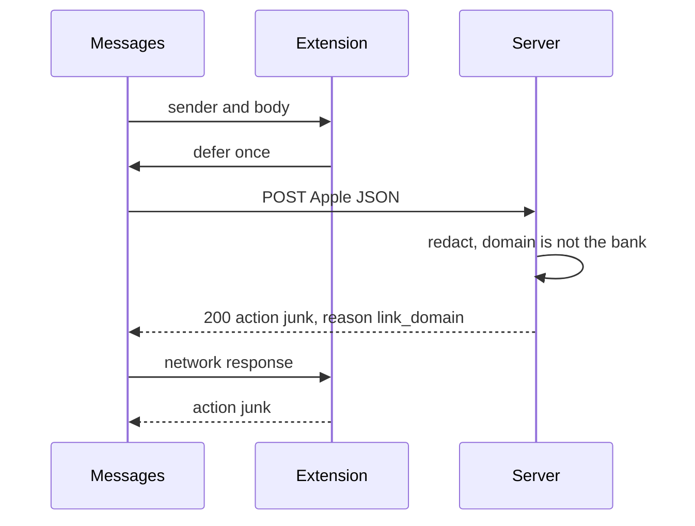

# Flow 2 — How the classification core is wired to the phone

Use this when you need the path of one message: who holds the text, who is allowed to open a socket, and which failures leave the message in the inbox.

The same path runs as an animation in [animations/wired.html](animations/wired.html). Five runs are built in: link mismatch, smishing language, a genuine one-time code, a failed request, and a message Messages never offers the filter.

## The core

Two pieces, one contract.

**FilterCore** sits in the extension process. It exposes a pure decision:

```text
QueryGate.canDefer(sender: String?, messageBody: String?) -> Bool
ServerDecisionDecoder.decode(Data) -> ServerDecision?
ActionMapper.map(ServerDecision) -> FilterDecision
decide(DeferralOutcome) -> FilterDecision
```

`DeferralOutcome` is the only input `decide` accepts. The extension builds that value from system types and then drops the system types. FilterCore does not import IdentityLookup.

**The server pipeline** runs on a host this product operates. Laya is loaded before traffic arrives. A cold load is not on the request path. The text is not forwarded to a hosted Laya API.

```text
redact secrets → extract domains → domain rule → Laya → policy → reply → discard the text
```

The wire between them is not a client inside the extension. It is Apple's deferral.

## Three processes

Only two processes contain this app's code. They do not share memory, files, or an app group. There is no arrow between the containing app and the extension.



The containing app can open its own Settings page. It cannot see whether Messages has selected the filter. The extension cannot see whether the person opened the app.

## The wire

1. Messages constructs `MessageFilterExtension` when an SMS or MMS arrives from a sender who is not in Contacts. iMessage and Contacts are not offered to the extension.
2. If the sender or the body is missing, the extension responds with action `none` and does not defer.
3. Otherwise it calls `deferQueryRequestToNetwork` once.
4. Messages posts Apple's JSON to `ILMessageFilterExtensionNetworkURL`.

```json
{
  "_version": 1,
  "query": {
    "sender": "14085550001",
    "message": {
      "text": "We locked your card. Confirm at the link."
    }
  },
  "app": {
    "version": "1"
  }
}
```

The associated-domains entitlement on the containing app is `messagefilter:<host>` for that URL. The host serves an Apple App Site Association file that authorizes this team and bundle id. Without that, deferral fails and the message stays in the inbox.

The extension receives `ILNetworkResponse` and builds a `DeferralOutcome`. It does not keep the system types.

| `DeferralOutcome` | `FilterDecision` |
|---|---|
| `missingFields` | inbox |
| `transportFailed` | inbox |
| HTTP status other than 200, including nil | inbox |
| body that does not decode | inbox |
| decoded `action == junk` | junk |
| decoded `action == none` | inbox |

`MessageFilterExtension` is the only type that writes `ILMessageFilterQueryResponse`. Inbox becomes `.none`. Junk becomes `.junk` with sub-action `.none`. The extension never returns `.allow`, `.promotion`, or `.transaction`.

## What the server does with the post

Before it classifies or stores anything:

1. Copy the text in memory. Replace one-time codes, primary account numbers, and similar digit secrets with a flag such as `contains_one_time_code`. Drop the original digits.
2. Extract link domains, and note whether a phone number is present.
3. If the text names a bank and a link domain is not that bank's domain, the action is `junk` with reason `link_domain`.
4. Otherwise ask Laya, already loaded, for `is_smishing`, `is_spam`, and `asks_to_continue_off_app`.
5. Apply the policy below.
6. Reply, then discard the text. Do not write the sender, the raw text, or the redacted text to a log or a database.

Operational metrics may count actions and reason codes. They must not include message content or sender identifiers. The endpoint is public. Rate-limit by IP. The reply contains no weights, thresholds, or prompt text.

```json
{
  "action": "junk",
  "reason": "link_domain"
}
```

| Field | Values |
|---|---|
| `action` | `junk` or `none` |
| `reason` | `link_domain`, `smishing_language`, or `none` |

`reason` is `smishing_language` when junk came from Laya. It is `none` when the action is `none`. Any HTTP status other than 200 is a failure. The extension then uses inbox.

## Policy

| Evidence | Action | Reason |
|---|---|---|
| Link domain is not the named bank's domain | `junk` | `link_domain` |
| Laya `is_smishing` and confidence are both at or above the fitted high threshold | `junk` | `smishing_language` |
| Anything else, including a middle score | `none` | `none` |

The high threshold is fitted on a set split by week. Genuine bank alerts and one-time-code texts are held out, and those held-out texts must receive `none`. Until that bar is met, the server may return `junk` only for `link_domain`.

`is_spam` does not file Junk. A spam folder is not available as a separate warning, and ordinary marketing is not the harm this version is for.

A middle score returns `none` because iOS cannot show a softer warning. Delivering the message is preferred to hiding a real bank alert under Junk.

## Five runs

These are the runs in the animation.

### Link domain is not the bank



Laya is not required on this path. The text appears under Junk. Junk is the whole warning. The app adds no banner.

### Smishing language, after the threshold is fitted

The domain rule does not fire. Laya's `is_smishing` score and confidence both clear the fitted high threshold. The server returns `junk` with reason `smishing_language`. The extension still ignores `reason` and maps `junk` the same way.

Until held-out genuine alerts and one-time-code texts stay at `none`, this path stays off and only `link_domain` may junk.

### A genuine one-time code

The server redacts the digits before Laya. The score is under the high threshold, or the text is in the held-out set that must receive `none`. The extension maps `none` to inbox. An inbox message has not been certified as genuine. No screen calls it credible, safe, or verified.

### The request fails

Airplane mode, timeout, a status other than 200, a body that is not the JSON above, an unknown `action` or `reason`, or an unauthorized associated domain: FilterCore returns inbox. A dead classifier must not swallow a real bank alert.

### Messages never offers it

An iMessage, or an SMS from someone in Contacts, is not posted to the classification URL. The extension is not started for it.

## What you preserve when you change the wire

- The extension still issues at most one deferral and still has no `URLSession`.
- Redaction still happens on the server, before Laya and before any log.
- Unknown JSON still becomes inbox.
- `junk` is still only the high-confidence cases in the policy table.
- The containing app still cannot read the decision.
- New copy still refuses the words credible, safe, and verified.

The place to put each of those changes is [flow 1](01-navigate-and-create.md).
